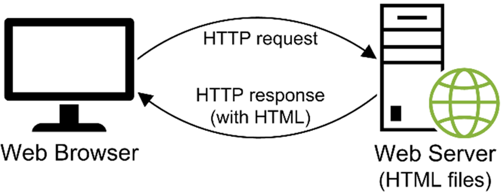
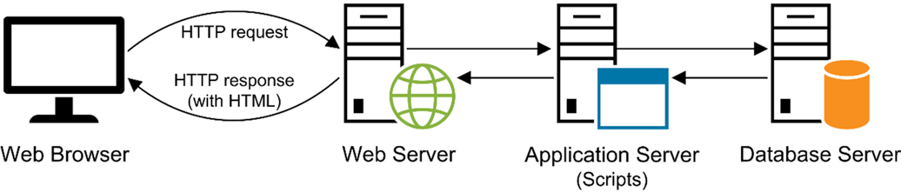
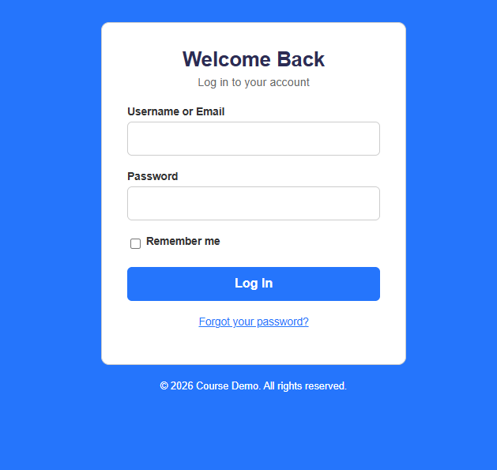

# Week 1: Server Functions, Protocols, Message Formats, HTML & CSS

**Course:** Web Application Development - Client-SideScripting  
**Textbook:** Delamater, M., *Murach's JavaScript and jQuery*, 4th Edition, Mike Murach & Associates Inc., 2020.

## Environment Check

Make sure you have the following installed and ready to be used:
**Checklist:**

- Google Chrome installed (we'll use Chrome DevTools all semester)
- VS Code installed
- A working folder created for the course, e.g. `~/web-dev-course/` - Optional

---

## The Components of a Web Application

| Term | Definition |
| --- | --- |
| Client | The program that requests and displays a web page (typically a browser) |
| Web server | The program that receives requests and returns responses |
| Network | The medium connecting clients and servers |
| Internet | A global network of networks |
| Intranet | A private network internal to an organization |
| LAN / WAN | Local Area Network vs. Wide Area Network |
| ISP | Internet Service Provider; connects a client to the Internet |

The figure below shows a typical network environment with various web application components:  <br> <br>


## The Client-Server Model

A **web application** is built on a request/response relationship between two programs:

- The **client** (almost always a web browser) initiates communication. It never acts on its own; it only responds to what the user does (typing a URL, clicking a link, submitting a form).
- The **web server** is a program that runs continuously, waiting for requests. It processes each request and sends back a response; it does not initiate contact with the client.

This is why the model is called **client-server**: responsibilities are split, and communication is always initiated by the client. Every interaction like loading a page, submitting a form, an app fetching new data, follows this same one request → one response pattern.

**The network types in context:** a request from your laptop to a college's registration system might travel client → LAN → ISP → Internet → the college's server. If that same request never left the campus network, it would be traveling over an **intranet** instead. Knowing the difference matters for questions about scope and access (an intranet is restricted to an organization; the Internet is public).

---

## HTTP Requests & Responses

**HTTP** (Hypertext Transfer Protocol) is the set of rules that defines how a client and server format and exchange messages. It's a **protocol** meaning, an agreed-upon message format, not a program itself. Every HTTP exchange has exactly two parts:

- **HTTP request**: sent from client to server. Contains a *method* (what the client wants to do), a *path* (what resource it wants), and *headers* (metadata about the request).
- **HTTP response**: sent from server back to client. Contains a *status code* (did it work?), *headers* (metadata about the response), and usually a *body* (the actual HTML, JSON, image, etc.). Image below shows a typical HTTP request and response. <br> <br>



**Common HTTP methods:**

| Method | Purpose |
| --- | --- |
| `GET` | Retrieve a resource (loading a page, fetching data) — should not change anything on the server |
| `POST` | Submit data to the server (e.g., a form submission that creates something) |
| `PUT` | Replace a resource entirely |
| `DELETE` | Remove a resource |

We'll only see `GET` and `POST` for now. `PUT`/`DELETE` become relevant once we build applications that talk to web services later in the course.

**Status code categories**: The first digit tells you the category before you even read the rest:

| Range | Category | Example |
| --- | --- | --- |
| 1xx | Informational | 100 Continue |
| 2xx | Success | 200 OK |
| 3xx | Redirection | 301 Moved Permanently, 302 Found |
| 4xx | Client error | 404 Not Found |
| 5xx | Server error | 500 Internal Server Error |

## Anatomy of a URL

Write a URL on the board and label every part:

```
https://www.example.com:443/products/shoes?color=red&size=10#reviews
└─┬──┘   └──────┬─────┘ └┬┘└─────┬───────┘└────────┬────────┘└──┬──┘
protocol      host      port    path             query        fragment
```

| Part | Example | Notes |
| --- | --- | --- |
| Protocol | `https://` | If omitted, browser defaults to `http://` or `https://` |
| Host | `www.example.com` | The domain name of the server |
| Port | `:443` | Usually omitted, defaults to 80 (HTTP) or 443 (HTTPS) |
| Path | `/products/shoes` | If omitted, server returns its default document (`index.html`, `default.htm`, etc.) |
| Query string | `?color=red&size=10` | Key/value pairs sent to the server |
| Fragment | `#reviews` | Client-side only, never sent to the server |


---

## Static vs. Dynamic Web Pages
- **Static page:** the server does almost no work. It receives the `GET` request, looks up the matching HTML file on disk, and sends it back unchanged. The same request always produces the same response.
- **Dynamic page:** the server runs a program (server-side processing) that builds the HTML fresh for that specific request before sending it back. A page like an amazon.com product listing is dynamic because the HTML is assembled per-request based on what's in the database at that moment.

Both static and dynamic pages ultimately send *HTML* back to the browser. The difference is entirely in *how the server produced that HTML*, not in what the browser does with it.

| | Static page | Dynamic page |
| --- | --- | --- |
| Content | Same HTML every time | Content generated per-request |
| Example | A plain HTML "About Us" page | A search results page, a shopping cart |
| Server does | Just returns the file | Runs code, queries a database, then builds HTML |

Image below shows the processing of a dynamic page: <br> <br>



## HTML & CSS
### HTML

**HTML (Hypertext Markup Language)** is a markup language, not a programming language which means it has no logic or computation. It describes the structure and meaning of content using nested elements. Every element that has both an opening and closing tag can contain other elements, forming a tree. This nested structure is exactly what the browser parses when it renders a page. Every HTML page follows the same basic skeleton, and each piece has a specific job:

| Piece | Purpose |
| --- | --- |
| `<!DOCTYPE html>` | Tells the browser to render the page using modern HTML5 rules (not an older, quirks-mode standard) |
| `<html>` | The root element. Everything else lives inside it |
| `<head>` | Metadata about the page. This is not displayed directly. Holds the `<title>`, character encoding, linked CSS, and other metadata |
| `<meta charset="utf-8">` | Declares the character encoding so text (including special characters) displays correctly |
| `<meta name="viewport" ...>` | Tells mobile browsers how to scale the page instead of rendering it as a shrunk desktop layout |
| `<title>` | The text shown in the browser tab and used by search engines/bookmarks |
| `<link>` | Connects the document to external resources, commonly CSS files and icons |
| `<style>` | Contains CSS written directly inside the HTML document |
| `<script>` | Adds or links JavaScript used to make the page interactive |
| `<body>` | Everything the user actually sees and interacts with |
| `<section>` | Groups related content into a logical section |
| `<h1>` | Main heading of the page |
| `<p>` | Defines a paragraph |
| `<br>` | Inserts a line break |
| `<hr>` | Represents a thematic break between sections of content |
| `<a>` | Creates a hyperlink to another page, location, file, or resource |
| `<div>` | Generic block-level container used to group content, often for styling or layout |
| `` | Displays an image |
| `<form>` | Creates a form for collecting user input |
| `<label>` | Provides a label for a form control |
| `<input>` | Creates an input control such as text, email, checkbox, radio button etc.
| `<button>` | Creates a clickable button |

Below is a simple HTML page:

```html
<!DOCTYPE html>
<html>
<head>
    <title>Page Title</title>
</head>
<body>
    <h1>This is a Heading</h1>
    <p>This is a paragraph.</p>

</body>
</html>

```
#### HTML Links
We can put a reference to a page using below:

```html
<a href="https://www.cmich.edu">This is a link</a>
```
The link's destination is specified in the href attribute. Attributes are used to provide additional information about HTML elements. Add `target="_blank"` to open in a new tab.

#### HTML Images
HTML images are defined with the  tag. The source file (src), alternative text (alt), width, and height are provided as attributes:

```html

```
#### HTML Horizontal Rules
The `<hr>` tag defines a thematic break in an HTML page, and is most often displayed as a horizontal rule. The `<hr>` tag is an empty tag, which means that it has no end tag.

```html
<h1>This is heading 1</h1>
<p>This is some text.</p>
<hr>
<h2>This is heading 2</h2>
<p>This is some other text.</p>
<hr>
```

#### HTML Line Breaks
The HTML `<br>` element defines a line break. Use `<br>` if you want a line break (a new line) without starting a new paragraph:

```html
<p>This is<br>a paragraph<br>with line breaks.</p>
```

#### The `<pre>` Element

```html
<pre>
  My Bonnie lies over the ocean.

  My Bonnie lies over the sea.

  My Bonnie lies over the ocean.

  Oh, bring back my Bonnie to me.
</pre>
```

#### The `<div>` Element
The `<div>` element is by default a block element, meaning that it takes all available width, and comes with line breaks before and after.

```html
This is <div>a div element</div> of HTML
```
The `<div>` element is often used to group sections of a web page together.

```html
<div>
		<h1>Central Michigan University</h1>
		<p>Department of Computer Science</p>
		<p>Web Development</p>
</div>
```

#### The HTML Style Attribute
Setting the style of an HTML element, can be done with the style attribute. The HTML style attribute has the following syntax:

```html
<tagname style="property:value;">
```

Below is an example of changing the font size of a paragraph element:
```html
<p style="font-size:20px">This is some text.</p>
```

Similarly, color can be used to change the color of the paragraph element:
```html
<p style="color:blue">This is some other text.</p>
```

Multiple styles can be applied to an HTML component:
```html
<p style="color:blue; text-align:center;" >This is some other text.</p>
```
It is highly recommended to put a `;` even when using a single style.

The table below shows some of the widely used properties:

| Piece | Purpose |
| --- | --- |
| `color` | Sets the text color |
| `background` | Sets background color, image, or other background properties |
| `font-family` | Sets the typeface |
| `font-size` | Sets the size of text |
| `font-weight` | Controls text thickness, such as `400` or `700` |
| `text-align` | Aligns text horizontally |
| `line-height` | Controls the spacing between lines of text |
| `width` | Sets an element's width |
| `height` | Sets an element's height |
| `margin` | Controls space outside an element |
| `padding` | Controls space inside an element |
| `border` | Adds a border around an element |
| `border-radius` | Rounds an element's corners |
| `box-shadow` | Adds a shadow around an element |
| `display` | Controls how an element participates in layout, such as `block`, `inline`, or `flex` |
| `position` | Controls how an element is positioned, such as `relative`, `absolute`, or `fixed` |
| `top / right / bottom / left` | Offsets positioned elements |
| `justify-content` | Aligns flex/grid items along the main axis |
| `grid-template-columns` | Defines the columns in a CSS grid |
| `overflow` | Controls what happens when content doesn't fit |
| `opacity` | Controls an element's transparency |


---

### CSS 
**CSS (Cascading Style Sheets)** is a separate language from HTML with one job: describing how HTML elements should look (color, spacing, layout, fonts), keeping presentation separate from structure/content.

**Three ways to add CSS to a page** (from least to most reusable):

| Method | How | When to use |
| --- | --- | --- |
| Inline | `style="color: blue;"` directly on an element | Easy but hard to maintain, avoid in real projects |
| Embedded | A `<style>` block inside `<head>` | One-off styles specific to a single page |
| External | A separate `.css` file linked with `<link rel="stylesheet" href="...">` | Standard approach for managing complex projects |


**Why "cascading"?** When more than one rule could apply to the same element, CSS uses a defined order to decide which wins:

1. Rules from an external stylesheet are applied first.
2. Embedded styles are applied next (and can override external ones).
3. If there are multiple external stylesheets linked, they're applied in order ( later ones can override earlier ones.)

A CSS rule consists of a selector and a declaration block: <br> <br>


The selector points to the HTML element you want to style. The declaration block contains one or more declarations separated by semicolons. Each declaration includes a CSS property name and a value, separated by a colon. Multiple CSS declarations are separated with semicolons, and declaration blocks are surrounded by curly braces.

First, link the stylesheet inside `<head>`:

```html
<link rel="stylesheet" href="styles.css">
```

Then build `styles.css` incrementally: type a rule, save, switch to browser, refresh, observe the change. Repeat.

Let's start simple by adding the following into `styles.css`. Make sure css and html files are in the same folder.

```css
p {
	color: red;
	font-size: 20px;
}
```

Here is the full HTML that will be styled using the above stylesheet.
```html
<!DOCTYPE html>
<html>
<head>
<title>Page Title</title>
<link rel="stylesheet" href="styles.css">
</head>
<body>

<h1>This is heading 1</h1>
<p style="font-size:20px">This is some text.</p>
<hr>
<h2>This is heading 2</h2>
<p style="color:blue; text-align:center;" >This is some other text.</p>
<hr>
<p>This is<br>a paragraph<br>with line breaks.</p>

<pre>
  My Bonnie lies over the ocean.

  My Bonnie lies over the sea.

  My Bonnie lies over the ocean.

  Oh, bring back my Bonnie to me.
</pre>

</body>
</html>
```

#### The CSS id Selector
The id selector uses the id attribute of an HTML element to select a specific element. The id of an element is unique within a page, so the id selector is used to select one unique element!

```css
#para1 {
  text-align: center;
  color: green;
}
```
Below is how it is applied to the component in the HTML file:

```html
<p id="para1">This is some text.</p>
```

#### The CSS class Selector
The class selector selects HTML elements with a specific class attribute. To select elements with a specific class, write a period (.) character, followed by the class name. Below can be used to set a class for a `<pre>`:

```css
pre.center {
	text-align: center;
	color: orange;
}
```
Below is the usage of this class in the HTML document:
```html
<pre class="center">
  My Bonnie lies over the ocean.

  My Bonnie lies over the sea.

  My Bonnie lies over the ocean.

  Oh, bring back my Bonnie to me.
</pre>
```

### Form with Styles
 Let's design a login form that uses the `<form>` component and styles to improve its look and feel.

 ```html
<!DOCTYPE html>
<html>
<head>
    <title>Login</title>
    <link rel="stylesheet" href="styles.css">
</head>
<body>
	<div id="login_card">
		<header>
			<h1>Login Page</h1>
		</header>
		
		<form>
			<div class="field">
			<label for="username">Username or Email </label>
			<input type="text">
			</div>
			
			<div class="field">
			<label for="password">Password</label>
			<input type="password">
			</div>
			
			<div class="field">
			<input type="submit" value="Log In" id="login_button">
			</div>
		</form>
	</div>
	<footer class="margin">Copyright 2026. All rights reserved.</footer>
</body>
</html>
 ```

Here is the `styles.css`:

```css
body {
    background-color: #f0f2f5;
    text-align: center;
    margin: 0;
    padding: 3em 1em;
}

#login_card {
    background-color: white;
    width: 320px;
    margin: 0 auto;
    padding: 2em;
    border: 1px solid #ccc;
    border-radius: 8px;
}

.field {
    margin-bottom: 1em;
    text-align: left;
}

.field label {
    display: block;
    margin-bottom: 0.3em;
    font-size: 0.9em;
    font-weight: bold;
}

.field input[type="text"],
.field input[type="password"] {
    width: 100%;
    padding: 0.5em;
    border: 1px solid #ccc;
    border-radius: 4px;
    font-size: 1em;
    box-sizing: border-box;
}

#login_button {
    width: 100%;
    padding: 0.6em;
    background-color: #2575fc;
    color: white;
    border: none;
    font-size: 1em;
    font-weight: bold;
}

footer.margin {
    margin: 2em 0;
}

```

## Exercise 
Take the login page we created above and improve its styles so that it looks professional and elegant. Can you make the login page look like below:



Feel free to improve it further.

## References
- [W3Schools - HTML and CSS](https://www.w3schools.com/htmlcss/)
- [Geeks for Geeks - HTML](https://www.geeksforgeeks.org/html/html-tutorial/)
- [HTML](https://html.com/)
