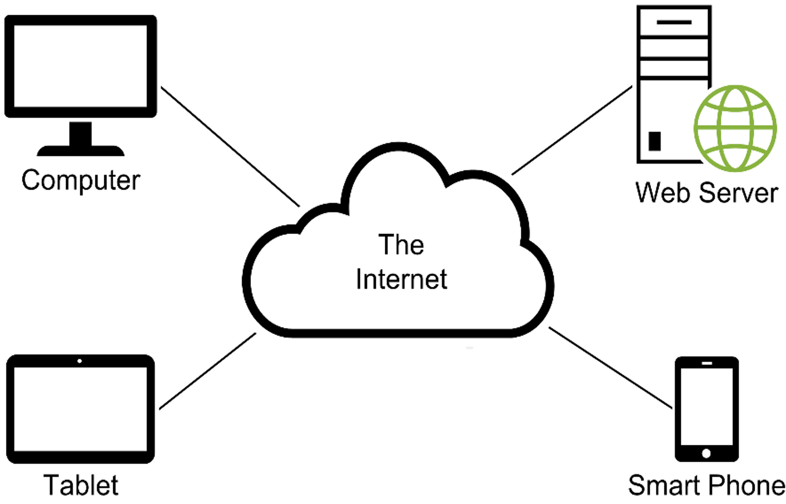

# Week 1: Server Functions, Protocols, Message Formats, HTML & CSS

**Course:** Web Application Development - Client-SideScripting  
**Textbook:** Delamater, M., *Murach's JavaScript and jQuery*, 4th Edition, Mike Murach & Associates Inc., 2020.

## Environment Check

Make sure you have the following installed and ready to be used:
**Checklist:**

- Google Chrome installed (we'll use Chrome DevTools all semester)
- VS Code installed
- A working folder created for the course, e.g. `~/web-dev-course/` - Optional

---

## The Components of a Web Application

| Term | Definition |
| --- | --- |
| Client | The program that requests and displays a web page (typically a browser) |
| Web server | The program that receives requests and returns responses |
| Network | The medium connecting clients and servers |
| Internet | A global network of networks |
| Intranet | A private network internal to an organization |
| LAN / WAN | Local Area Network vs. Wide Area Network |
| ISP | Internet Service Provider; connects a client to the Internet |

The figure below shows a typical network environment with various web application components:


**Discussion prompt:** Ask students to name 3 web applications they used today. For each, ask: "Was that page the *same* every time you loaded it, or did it change based on who you are / what you searched?" — this sets up the static vs. dynamic distinction below.

#### Theory: The Client-Server Model

A **web application** is built on a request/response relationship between two programs:

- The **client** (almost always a web browser) initiates communication. It never acts on its own — it only responds to what the user does (typing a URL, clicking a link, submitting a form).
- The **web server** is a program that runs continuously, waiting for requests. It processes each request and sends back a response — it does not initiate contact with the client.

This is why the model is called **client-server**: responsibilities are split, and communication is always initiated by the client. Every interaction — loading a page, submitting a form, an app fetching new data — follows this same one request → one response pattern.

**The network types in context:** a request from your laptop to a college's registration system might travel client → LAN → ISP → Internet → the college's server. If that same request never left the campus network, it would be traveling over an **intranet** instead. Knowing the difference matters for questions about scope and access (an intranet is restricted to an organization; the Internet is public).

> **Exam-relevant distinction:** *Client* and *server* are roles, not devices — the same physical machine could run server software and serve pages to itself. What makes something a "server" is that it's listening for and responding to requests.

---

### 4. HTTP Requests & Responses — Hands-On (20 min)

This is the first hands-on segment. Everyone opens Chrome.

#### Theory: What HTTP Actually Is

**HTTP** (Hypertext Transfer Protocol) is the set of rules that defines how a client and server format and exchange messages. It's a **protocol** — an agreed-upon message format — not a program itself. Every HTTP exchange has exactly two parts:

- **HTTP request** — sent from client to server. Contains a *method* (what the client wants to do), a *path* (what resource it wants), and *headers* (metadata about the request).
- **HTTP response** — sent from server back to client. Contains a *status code* (did it work?), *headers* (metadata about the response), and usually a *body* (the actual HTML, JSON, image, etc.).

**Common HTTP methods:**

| Method | Purpose |
| --- | --- |
| `GET` | Retrieve a resource (loading a page, fetching data) — should not change anything on the server |
| `POST` | Submit data to the server (e.g., a form submission that creates something) |
| `PUT` | Replace a resource entirely |
| `DELETE` | Remove a resource |

We'll only see `GET` and `POST` for now — `PUT`/`DELETE` become relevant once we build applications that talk to web services later in the course.

**Status code categories** — the first digit tells you the category before you even read the rest:

| Range | Category | Example |
| --- | --- | --- |
| 1xx | Informational | 100 Continue |
| 2xx | Success | 200 OK |
| 3xx | Redirection | 301 Moved Permanently, 302 Found |
| 4xx | Client error | 404 Not Found |
| 5xx | Server error | 500 Internal Server Error |

**Headers**, in short, are key/value metadata attached to a request or response — they describe the message without being part of its main content. `Content-Type`, for example, tells the client *how to interpret* the response body (as HTML, JSON, an image, etc.).

**Rendering a page** is the browser's process of taking the HTML it received in the response body and turning it into what you see on screen — parsing the markup, building the page structure, applying CSS, and displaying the result.

#### Step 1 — Open DevTools and watch a real request

**Live demo, students follow along:**

1. Open Chrome.
2. Press `F12` (or `Ctrl+Shift+I` / `Cmd+Option+I` on Mac) to open DevTools.
3. Click the **Network** tab.
4. Check **Preserve log**.
5. In the address bar, navigate to `https://example.com`.
6. Click on the top request in the Network panel (the one for `example.com`).

**Have students find and read aloud:**

- **Request Method** — should say `GET`
- **Status Code** — should say `200 OK`
- **Request Headers** — look for `Host`, `User-Agent`, `Accept`
- **Response Headers** — look for `Content-Type`, `Content-Length`

#### Step 2 — Exercise: Classify the request/response

Have students visit two more sites (e.g., their college's homepage and one of their own choosing) and fill in this table individually or in pairs:

| Site | Status Code | Content-Type of response | Any request that returned something other than 200? |
| --- | --- | --- | --- |
| example.com | | | |
| (your choice) | | | |
| (your choice) | | | |

**Debrief questions:**
- Did anyone see a status code other than 200 (e.g., 301, 302, 404)? What might that mean?
- What's the difference between what the *browser* sent and what it *received*?

> **Key terms to lock in:** `HTTP request`, `HTTP response`, `status code`, `header`, `rendering a page`

---

### 5. Anatomy of a URL (10 min)

Write a URL on the board and label every part:

```
https://www.example.com:443/products/shoes?color=red&size=10#reviews
└─┬──┘   └───────┬───────┘└┬┘└─────┬──────┘└────────┬────────┘└──┬──┘
protocol      host        port    path             query        fragment
```

| Part | Example | Notes |
| --- | --- | --- |
| Protocol | `https://` | If omitted, browser defaults to `http://` or `https://` |
| Host | `www.example.com` | The domain name of the server |
| Port | `:443` | Usually omitted — defaults to 80 (HTTP) or 443 (HTTPS) |
| Path | `/products/shoes` | If omitted, server returns its default document (`index.html`, `default.htm`, etc.) |
| Query string | `?color=red&size=10` | Key/value pairs sent to the server |
| Fragment | `#reviews` | Client-side only — never sent to the server |

**Quick exercise:** Give students a URL like `https://api.github.com/search/repositories?q=javascript&sort=stars` and have them label each component individually, then check with a neighbor.

> **Note on defaults:** A URL is really a shorthand — the browser fills in missing pieces using defaults. Omit the protocol and the browser assumes `http://` or `https://`; omit the path/filename and the server returns its configured default document. This matters because two URLs that "look different" (`example.com` vs. `example.com/index.html`) can point to the exact same resource.

---

### 6. Static vs. Dynamic Web Pages (5 min, wrap-up)

| | Static page | Dynamic page |
| --- | --- | --- |
| Content | Same HTML every time | Content generated per-request |
| Example | A plain HTML "About Us" page | A search results page, a shopping cart |
| Server does | Just returns the file | Runs code, queries a database, then builds HTML |

**Theory — how each is actually processed:**

- **Static page:** the server does almost no work. It receives the `GET` request, looks up the matching HTML file on disk, and sends it back unchanged. The same request always produces the same response.
- **Dynamic page:** the server runs a program (server-side processing) — often involving an **application server** and a **database server** — that builds the HTML fresh for that specific request before sending it back. This full cycle (request → server-side processing → response) is sometimes called a **round trip**. A page like an amazon.com product listing is dynamic because the HTML is assembled per-request based on what's in the database at that moment.

Both static and dynamic pages ultimately send *HTML* back to the browser — the difference is entirely in *how the server produced that HTML*, not in what the browser does with it.

**Bridge to Class 2:** "Today we saw *what* travels between browser and server. Next class, we start actually writing what the browser renders — HTML and CSS — since that's what a static page *is*."

---

## Class 2 (80 min): HTML & CSS Refresher — Hands-On Build

> This class assumes students already know HTML/CSS basics from the prerequisite web design course. The goal is **not** to reteach from zero — it's a fast, applied refresher that gets everyone writing code in the same style we'll build on all semester (the style used in the textbook), while filling gaps that matter for JavaScript work later (`id`, `class`, semantic elements, selectors).

### Agenda

| Time | Segment |
| --- | --- |
| 0:00 – 0:10 | Set up the project folder in VS Code |
| 0:10 – 0:30 | Build the HTML skeleton (hands-on) |
| 0:30 – 0:50 | Style it with CSS (hands-on) |
| 0:50 – 1:05 | Selectors deep dive: type, id, class (hands-on) |
| 1:05 – 1:20 | Semantic HTML5 + key attributes, wrap-up exercise |

---

### 1. Project Setup (10 min)

**Everyone does this together:**

1. Open VS Code.
2. `File → Open Folder` → create/select a folder named `week01-email-list`.
3. Create two files at the root of that folder:
   - `index.html`
   - `styles.css`

> **Tip for students:** Click the file once to *preview* it (tab name shows in italics); double-click to *open* it in Standard Mode so it stays open while you click around.

---

### 2. Build the HTML Skeleton (20 min, live-typed together)

#### Theory: What Every HTML Document Needs

Every HTML page follows the same basic skeleton, and each piece has a specific job:

| Piece | Purpose |
| --- | --- |
| `<!DOCTYPE html>` | Tells the browser to render the page using modern HTML5 rules (not an older, quirks-mode standard) |
| `<html>` | The root element — everything else lives inside it |
| `<head>` | Metadata about the page — not displayed directly. Holds the `<title>`, character encoding, linked CSS, and (later) linked JavaScript |
| `<meta charset="utf-8">` | Declares the character encoding so text (including special characters) displays correctly |
| `<meta name="viewport" ...>` | Tells mobile browsers how to scale the page instead of rendering it as a shrunk desktop layout |
| `<title>` | The text shown in the browser tab and used by search engines/bookmarks |
| `<body>` | Everything the user actually sees and interacts with |

**HTML itself (Hypertext Markup Language)** is a *markup* language, not a programming language — it has no logic or computation. It describes the **structure and meaning** of content using nested elements. Every element that has both an opening and closing tag can contain other elements, forming a tree — this nested structure is exactly what the browser parses when it "renders" a page (recall that term from Class 1).

Type this out with the class, explaining each line as you go — don't paste it in one shot.

```html
<!DOCTYPE html>
<html>
<head>
    <meta charset="utf-8" />
    <meta name="viewport"
        content="width=device-width, initial-scale=1">
    <title>Join Email List</title>
    <!-- link and style elements go here -->
</head>
<body>
    <main>
        <h1>Please join our email list</h1>
        <form id="email_form" action="join.html" method="get">
            <div>
                <label for="email_1">Email Address:</label>
                <input type="text" id="email_1" name="email_1">
                <span id="email_1_error">*</span>
            </div>
            <div>
                <label for="email_2">Re-enter Email Address:</label>
                <input type="text" id="email_2" name="email_2">
                <span id="email_2_error">*</span>
            </div>
            <div>
                <label for="first_name">First Name</label>
                <input type="text" id="first_name" name="first_name">
                <span id="first_name_error">*</span>
            </div>
            <div>
                <label>&nbsp;</label>
                <input type="submit" id="join_list" value="Join List">
                <input type="button" id="clear_form" value="Clear Form">
            </div>
        </form>
    </main>
    <!-- script elements go here -->
</body>
</html>
```

**Save the file, then run it:**

- Right-click `index.html` in the Explorer → **Open in Default Browser** (if the Open in Browser extension is installed), **or**
- Right-click → **Reveal in File Explorer / Finder** → double-click the file.

**Checkpoint:** The page should render as plain, unstyled text and form fields. Ask: "Why does this look so bare?" → leads into CSS.

---

### 3. Style It with CSS (20 min, live-typed together)

#### Theory: What CSS Is and How Styles Get Applied

**CSS (Cascading Style Sheets)** is a separate language from HTML with one job: describing how HTML elements should *look* (color, spacing, layout, fonts), keeping presentation separate from structure/content.

**Three ways to add CSS to a page** (from least to most reusable):

| Method | How | When to use |
| --- | --- | --- |
| Inline | `style="color: blue;"` directly on an element | Rare — hard to maintain, avoid in real projects |
| Embedded | A `<style>` block inside `<head>` | One-off styles specific to a single page |
| External | A separate `.css` file linked with `<link rel="stylesheet" href="...">` | Standard approach — one stylesheet can style many pages |

We'll always use the **external** approach in this course, since it's what real projects use and what the textbook uses throughout.

**Why "cascading"?** When more than one rule could apply to the same element, CSS uses a defined order to decide which wins:

1. Rules from an external stylesheet are applied first.
2. Embedded styles are applied next (and can override external ones).
3. If there are multiple external stylesheets linked, they're applied in order — later ones can override earlier ones.

We'll revisit this "who wins" question again in the selectors section below, since selector type also affects it.

First, link the stylesheet inside `<head>`:

```html
<link rel="stylesheet" href="styles.css">
```

Then build `styles.css` incrementally — type a rule, save, switch to browser, refresh, observe the change. Repeat.

```css
body {
    font-family: Arial, Helvetica, sans-serif;
    background-color: white;
    margin: 0 auto;
    width: 670px;
    border: 3px solid blue;
    padding: 0 2em 1em;
}

h1 {
    color: blue;
}

div {
    margin-bottom: 1em;
}

label {
    display: inline-block;
    width: 11em;
    text-align: right;
}

input {
    margin-left: 1em;
    margin-right: 0.5em;
}

span {
    color: red;
}
```

**Checkpoint:** The form should now look laid out and styled — labels right-aligned, a blue border around the page, red asterisks.

---

### 4. Selectors Deep Dive: Type, ID, and Class (15 min, hands-on)

**Explain the anatomy of a style rule first:**

```css
selector {
    property-name: property-value;
}
```

| Part | Example | Meaning |
| --- | --- | --- |
| Selector | `h1` | What element(s) this rule targets |
| Property declaration | `color: blue;` | One property name + value pair |
| Property name | `color` | What aspect is being styled |
| Property value | `blue` | The value applied |

**Now demonstrate the three selector types side by side.** Have students add a second paragraph and a footer to their `index.html`, just below `</form>` and still inside `<main>` or after it:

```html
<p class="note">We never share your email address.</p>
<footer>
    <p id="copyright" class="note">&copy; 2026 Course Demo</p>
</footer>
```

Then add these rules to `styles.css`, explaining each selector type as you type it:

```css
/* Type selector — targets every <p> element */
p {
    font-size: 90%;
}

/* Class selector — targets any element with class="note" */
.note {
    color: gray;
    font-style: italic;
}

/* ID selector — targets the one element with id="copyright" */
#copyright {
    text-align: right;
}
```

**Exercise (students work individually, 5 min):**

1. Add a `class="highlight"` to the `<h1>`.
2. Write a `.highlight` rule that changes its background color.
3. Add a second `<p>` somewhere and give it `id="warning"`, then write an `#warning` rule that makes its text bold.
4. Refresh the browser and confirm both changes appear.

#### Theory: Specificity — Which Rule Wins?

When multiple rules target the *same* element, CSS picks a winner using **specificity** — roughly, how "precise" the selector is:

| Selector type | Specificity (low → high) |
| --- | --- |
| Type selector (`p`) | Lowest |
| Class selector (`.note`) | Medium |
| ID selector (`#copyright`) | Highest |

So if `p { color: gray; }` and `.note { color: red; }` both apply to the same `<p class="note">`, the class rule wins because a class selector is more specific than a type selector. An ID selector beats both. This is *why* IDs are typically reserved for one-of-a-kind elements — using an ID selector for something that could apply to many elements makes later overrides harder.

> **Exam-relevant rule of thumb:** specificity is about the *selector*, not the order the rules are written in — a more specific selector wins even if it's written first in the file. Order only acts as the tiebreaker when specificity is equal.

---

### 5. Semantic HTML5 & Key Attributes (15 min)

**Semantic elements — quick reference:**

| Element | Purpose |
| --- | --- |
| `header` | Introductory content, typically at the top of a page or section |
| `main` | The dominant content of the page (one per page) |
| `section` | A thematic grouping of content |
| `article` | Self-contained content (a blog post, a news story) |
| `aside` | Content tangentially related to the main content |
| `nav` | A block of navigation links |
| `figure` | Self-contained media (image, diagram) with an optional caption |
| `footer` | Footer content for a page or section |

**Discussion:** Why use `<header>` instead of just `<div class="header">`? → Semantic meaning helps accessibility tools (screen readers) and makes code more self-documenting. `div` and `span` carry **no** meaning — they're generic containers, useful specifically *because* they're neutral (we'll lean on them heavily once we start using JavaScript to target elements).

**Key attributes to know cold before we touch JavaScript:**

| Attribute | Used for |
| --- | --- |
| `id` | A unique identifier for one element — used for CSS `#id` selectors and, soon, JavaScript targeting |
| `class` | A reusable label shared by many elements — used for CSS `.class` selectors and grouping |
| `name` | Identifies form data when submitted to a server |
| `for` | On a `<label>`, links it to a form control's `id` (improves accessibility — clicking the label focuses the input) |
| `title` | Adds a tooltip shown on hover |

**Final wrap-up exercise (10 min, pairs):**

Have students refactor their `index.html` to wrap the form in a `<header>` + `<main>` + `<footer>` structure instead of a flat `<main>`, and add a `title` attribute to the email input that says `"Enter a valid email address."` Confirm the tooltip appears on hover in the browser.

---

## What to Bring to Week 2

Students should leave Week 1 with:

- A working `week01-email-list` folder containing a validated `index.html` and `styles.css`
- Comfort opening DevTools' Network tab and reading a request/response
- Comfort explaining the difference between type, id, and class selectors
- A page they'll extend in Week 2 once we start adding real JavaScript behavior to it

> **Instructor note:** Keep this exact `index.html`/`styles.css` pair — Week 2 (Getting Started with JS) will attach a `script.js` to this same file, so having a clean, working starting point matters.

---

## Study Guide: Key Concepts for Quizzes/Exams

Use this section to review — it summarizes the theory covered above without the hands-on steps.

**Client-server model**
- A *client* initiates requests; a *server* listens and responds. These are roles, not specific devices.
- Network scope terms: LAN (local), WAN (wide-area), intranet (private/organizational), Internet (global, public), and the role of an ISP in connecting a client to it.

**HTTP**
- HTTP is a *protocol* — a message format both client and server agree to use — not a program.
- A request has a method (`GET`, `POST`, `PUT`, `DELETE`) and a path; a response has a status code and usually a body.
- Status codes are grouped by their first digit: 1xx informational, 2xx success, 3xx redirection, 4xx client error, 5xx server error.
- Headers carry metadata (e.g., `Content-Type`) describing the message, separate from its actual content.

**URLs**
- A URL has up to six parts: protocol, host, port, path, query string, and fragment.
- Omitted parts fall back to defaults (protocol defaults to `http://`/`https://`; missing path returns the server's default document).
- The fragment (`#...`) never leaves the browser — it's not sent to the server.

**Static vs. dynamic pages**
- Static: the server returns a file unchanged — same request, same response, every time.
- Dynamic: the server runs code (server-side processing), often involving an application server and database server, to build the HTML fresh per request — this full cycle is a round trip.

**HTML**
- HTML is a *markup* language (structure/meaning), not a programming language (no logic/computation).
- Elements nest to form a tree, which the browser parses when rendering the page.
- `<head>` holds metadata (not shown to the user); `<body>` holds what's displayed.

**CSS**
- CSS controls presentation, kept separate from HTML's structure/content.
- Three ways to apply it: inline, embedded, external — external is standard practice.
- "Cascading" refers to the defined order used to resolve conflicting rules.
- Specificity (type < class < id) decides which rule wins when multiple selectors target the same element, regardless of the order they're written in.

**Semantic HTML & key attributes**
- Semantic elements (`header`, `main`, `nav`, `section`, `article`, `aside`, `figure`, `footer`) describe meaning; `div`/`span` are meaning-neutral containers.
- `id` = unique identifier (one element); `class` = reusable label (many elements); `name` = identifies form data sent to the server; `for` = links a `<label>` to a form control; `title` = hover tooltip.
