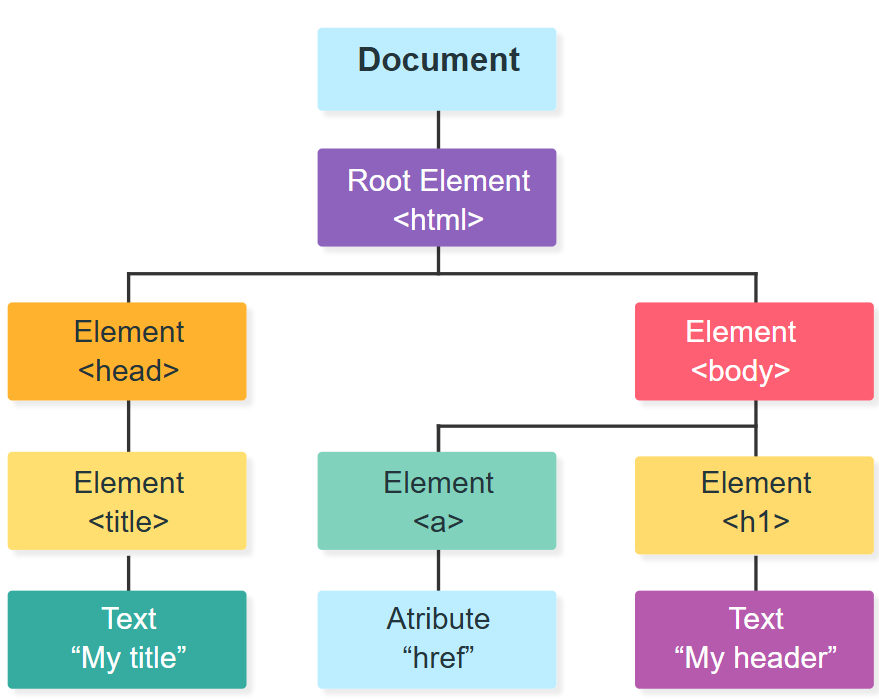

# Week 4: Scripting the DOM

## The Document Object Model

Every time a browser loads an HTML page, it builds a live, in-memory model of that page called the Document Object Model, or DOM. The DOM represents the page as a tree of objects, one object for every element, attribute, and piece of text on the page.

Up to this point, JavaScript has run without touching the actual page. Week 2 used `prompt()` and `alert()` to avoid the DOM entirely, and Week 3 used inline `onclick` attributes so events could work without formally selecting elements. This week changes that. JavaScript can now read the DOM, change it, and react to what happens on the page in real time.

The key idea is that HTML defines what the page looks like when it first loads, and the DOM is what the browser is actually looking at right now. JavaScript talks to the DOM, not to the original HTML file. Change the DOM, and the visible page changes immediately, with no page reload.



## Selecting Elements

Before JavaScript can do anything to an element, it has to find it first. The `document` object is the entry point into the DOM, and it provides several methods for selecting elements.

`getElementById()` selects a single element by its `id` attribute. Since ids are supposed to be unique on a page, this always returns one element or `null` if nothing matches.

```js
const heading = document.getElementById("main-heading");
```

`querySelector()` selects the first element that matches a CSS selector. This means anything that works in a stylesheet, a tag name, a class, an id, or a more complex selector, also works here.

```js
const firstItem = document.querySelector(".list-item");
```

`querySelectorAll()` selects every element that matches a CSS selector and returns a NodeList, which behaves a lot like an array of elements.

```js
const allItems = document.querySelectorAll(".list-item");
```

## Reading and Writing Content

Once an element is selected, its content can be read or replaced.

`textContent` gets or sets the plain text inside an element.

```js
heading.textContent = "Welcome back!";
```

`innerHTML` gets or sets the HTML markup inside an element, including tags. This is more powerful than `textContent` but also riskier, since inserting untrusted text with `innerHTML` can introduce security problems. For now, stick to `textContent` unless actual HTML markup needs to be inserted.

For reading `textContent` from collection we can use a for loop:
```js
const allItems = document.querySelectorAll(".list-item");

for (const item of allItems) {
    console.log(item.textContent);
}
```

for loop has a variation that is very handy called `forEach` which can be used to iterate through collection of elements:
```js
allItems.forEach(element => {
    console.log(element.textContent);
});
```

`element =>` is a shorthand way of writing an anonymous function:
```js
allItems.forEach(function(item) {
  console.log(item.textContent);
});
```

## Working with Attributes and Styles

Elements have attributes, and JavaScript can read or change them directly.

```js
const logo = document.querySelector("img");
logo.setAttribute("alt", "Company logo");
console.log(logo.getAttribute("src"));
```

Many common attributes also have a matching property that can be set directly, which is usually simpler than `setAttribute()`.

```js
logo.src = "images/new-logo.png";
```

Inline styles can be set through the `style` property.

```js
heading.style.color = "blue";
heading.style.fontSize = "2rem";
```

Setting individual style properties from JavaScript works, but it mixes styling logic into script files, which goes against the separation of HTML, CSS, and JS this course has followed since Week 1. A cleaner approach is to define the desired look as a CSS class in the stylesheet, then let JavaScript add or remove that class.

We can access stylesheet components from JS. Below is an example:

```html
<!DOCTYPE html>
<html>
<head>
  <title>Welcome Page</title>
  <link rel="stylesheet" href="style.css">
</head>
<body>
    <h1 id="h1_heading">Welcome!</h1>
    <p id="para">This page is running JavaScript</p>

  <script src="week_4.js"></script>
</body>
</html>
```
Here is the stylesheet which we want to use through JS:
```css
.highlight {
    color: red;
    background-color: yellow;
}
```
Here is the JS that adds the style using `classList.add`:
```js
const heading = document.getElementById("h1_heading");

heading.classList.add("highlight");

```

## Exercise: Task Manager
Write JavaScript that:
- Adds today's date to the heading.
- Selects all .list-item elements and makes them bold.
- Creates `isHighlighted` to track the highlight state.
- Creates `toggle_highlight()` that adds/removes the "highlight" class.
- Connects the function to the button's click event.

Here is the HTML:
```html
<!DOCTYPE html>
<html>
<head>
    <title>Task List</title>
    <link rel="stylesheet" href="style.css">
</head>

<body>

    <h1 id="main-heading">My Tasks</h1>

    <ul id="task-list">
        <li class="list-item">Learn JavaScript</li>
        <li class="list-item">Practice DOM manipulation</li>
        <li class="list-item">Build a small project</li>
    </ul>

    <button id="highlight-btn">Toggle Highlight</button>

    <script src="week_4.js"></script>
</body>
</html>

```

Here is the CSS:
```css
.highlight {
    background-color: yellow;
    font-weight: bold;
}
```

### Solution
```js
// Heading
const main_heading = document.getElementById("main-heading");
const today = new Date().toLocaleDateString();

main_heading.textContent = "Today's Tasks (" + today + ")"

// List
const items = document.querySelectorAll(".list-item");

items.forEach(element => {
    element.style.fontWeight = "bold";
});

// Toggle Highlight
let isHighlighted = false;

function toggle_highlight() {
    if (isHighlighted === false) {
        items.forEach(element => {
            element.classList.add("highlight");
        });

        isHighlighted = true;
    } else {
        items.forEach(element => {
            element.classList.remove("highlight");
        });

        isHighlighted = false;
    }
}
```

**Challenge:** Add a second button called "Complete All".

When clicked, it should:
- Add a new CSS class called .completed.
- Make all tasks have a text-decoration: line-through.
- Change the button text to "Completed!".

## Events via the DOM

Week 3 used the inline `onclick` attribute to wire up events directly in the HTML.

```html
<button onclick="doSomething()">Click Me</button>
```

This works, but it mixes JavaScript into the HTML, which the rest of this course has avoided since Week 1. Now that elements can be selected from a script file, events can be attached the same way, using `addEventListener()`.

```js
const button = document.getElementById("my-button");
button.addEventListener("click", doSomething);
```

`addEventListener()` takes an event type as a string and a function to run when that event fires. The function is not called with parentheses here, since it should be passed as a reference for the browser to call later, not run immediately.

An element can also listen for more than one type of event, and multiple listeners can be attached to the same event without overwriting each other, which is not possible with inline attributes or the `.onclick` property.

Checkpoint. Rewrite the Profile Card Updater's button so it uses `addEventListener()` instead of `.onclick`, save, refresh, and confirm it still works.

## The Event Object

Every event listener function automatically receives an event object as its first parameter. This object holds information about what happened.

```js
button.addEventListener("click", function (event) {
  console.log(event.type);
  console.log(event.target);
});
```

`event.target` is especially useful, since it refers to the exact element that triggered the event. This matters when the same listener is attached to several elements at once.

There are some other events that can be used. For example, if we want to change the color of the text of a button on mouse hover to red and change it back to black when the cursor leaves, we can do something like below:
```js
const btnHighlighted = document.getElementById("highlight-btn");

btnHighlighted.addEventListener("mouseenter", event => {
    console.log("cursor entered");
    btnHighlighted.style.color = "red";
    // event.target.style.color = "red"    <- also possible.
});

btnHighlighted.addEventListener("mouseleave", event => {
    console.log("cursor entered");
    btnHighlighted.style.color = "black";
});
```

## DOM Traversal and Creating Elements

Elements do not exist in isolation. Every element in the DOM has a relationship to the elements around it.

```js
const item = document.querySelector(".list-item");
console.log(item.parentElement);
console.log(item.children);
console.log(item.closest(".container"));
```

`parentElement` moves up to the containing element. `children` returns the direct child elements. `closest()` searches upward from the element and returns the nearest ancestor that matches a given selector, which is useful when a click happens on something inside a larger clickable region.

New elements can also be built entirely in JavaScript and inserted into the page.

```js
const item = document.querySelector("#task-list");

const newItem = document.createElement("li");
newItem.textContent = "Practice";

item.appendChild(newItem);
```

Elements can be removed the same way they were added.

```js
newItem.remove();
```

## Exercise: Coffee Order Tracker, Revisited

You are given the HTML and CSS for a Corner Cafe ordering page. Write the JavaScript to make the page functional. Script should do the following:

- Store the menu prices in an object.
- Store the quantity ordered for each item in another object.
- When a menu button is clicked, add that item to the order.
- Create a `calculateTotal()` function that calculates the total price.
- Create a `showSummary()` function that displays the ordered items and total inside `#total-order`.
- Use `addEventListener()` to handle the button clicks.

Here is the HTML:
```html
<!DOCTYPE html>
<html lang="en">
<head>
    <meta charset="UTF-8">
    <meta name="viewport" content="width=device-width, initial-scale=1.0">
    <title>Corner Cafe | Coffee Order Tracker</title>
    <link rel="stylesheet" href="style.css">
</head>

<body>

    <main class="container">

        <div class="logo">☕</div>

        <h1>Corner Cafe</h1>

        <p class="subtitle">
            Tap an item to add it to your order.
        </p>

        <section class="menu">

            <button id="btn-coffee">
                ☕ Coffee
                <span class="price">$3</span>
            </button>

            <button id="btn-latte">
                🥛 Latte
                <span class="price">$5</span>
            </button>

            <button id="btn-muffin">
                🧁 Muffin
                <span class="price">$4</span>
            </button>

        </section>

        <hr class="divider">

        <button id="summary-btn" class="summary-btn">
            View Order Summary
        </button>

        <div id="order-summary">
            <h2>☕ Your Order</h2>
            <p id="total-order" class="empty-message">No items added yet.</p>
        </div>

        <p class="footer">
            Thank you for visiting Corner Cafe!
        </p>

    </main>

    <script src="week_4.js"></script>

</body>
</html>
```

Here is the css
```css
* {
    box-sizing: border-box;
    margin: 0;
    padding: 0;
}

body {
    font-family: Arial, Helvetica, sans-serif;
    min-height: 100vh;
    background: #f5f1eb;
    display: flex;
    justify-content: center;
    align-items: center;
    color: #2f241f;
}

.container {
    width: 90%;
    max-width: 650px;
    background: white;
    padding: 40px;
    border-radius: 16px;
    box-shadow: 0 8px 30px rgba(0, 0, 0, 0.12);
    text-align: center;
}

.logo {
    font-size: 48px;
    margin-bottom: 10px;
}

h1 {
    font-size: 36px;
    margin-bottom: 8px;
    color: #4b2e22;
}

.subtitle {
    color: #766860;
    margin-bottom: 30px;
    font-size: 16px;
}

.menu {
    display: grid;
    grid-template-columns: repeat(3, 1fr);
    gap: 15px;
    margin-bottom: 30px;
}

.menu button {
    border: 2px solid #e0d4cc;
    background: #faf8f6;
    color: #3d2b24;
    padding: 20px 10px;
    border-radius: 12px;
    font-size: 16px;
    font-weight: bold;
    cursor: pointer;
    transition: all 0.2s ease;
}

.menu button:hover {
    background: #f1e5dc;
    border-color: #a56b4f;
    transform: translateY(-2px);
}

.menu button:active {
    transform: translateY(0);
}

.price {
    display: block;
    margin-top: 6px;
    font-size: 14px;
    font-weight: normal;
    color: #8b6f61;
}

.divider {
    border: none;
    border-top: 1px solid #e5ddd8;
    margin: 10px 0 25px;
}

.summary-btn {
    width: 100%;
    padding: 16px;
    border: none;
    border-radius: 10px;
    background: #4b2e22;
    color: white;
    font-size: 17px;
    font-weight: bold;
    cursor: pointer;
    transition: background 0.2s ease;
}

.summary-btn:hover {
    background: #684333;
}

/* Order Summary */

#order-summary {
    margin-top: 20px;
    padding: 20px;
    background: #faf8f6;
    border: 1px solid #e5ddd8;
    border-radius: 10px;
    text-align: left;
}

#order-summary h2 {
    margin-bottom: 15px;
    color: #4b2e22;
}

#order-summary p {
    margin-bottom: 8px;
}

#order-summary strong {
    display: block;
    margin-top: 15px;
    padding-top: 15px;
    border-top: 1px solid #e5ddd8;
    color: #4b2e22;
}

#total-order {
    white-space: pre-line;
}

.footer {
    margin-top: 25px;
    font-size: 13px;
    color: #998c85;
}

```

### Solution

```js
let menu = {
    coffee: 3,
    latte: 5,
    muffin: 4
};

let order = {
    coffee: 0,
    latte: 0,
    muffin: 0
};

const total_order = document.getElementById("total-order");

function addToOrder(item) {
    order[item] = order[item] + 1;
    alert(item + " added to your order.");
}

function calculateTotal()
{
    let total = 0;
    for (let item in order) {
        total = total + order[item] * menu[item];
    }
    return total;
}

function showSummary()
{
    let receipt = "Order Summary\n";

    for (let item in order) {
        if (order[item] > 0) {
            receipt += order[item] + " x " + item + "\n";
        }
    }

    receipt += "Total: $" + calculateTotal();

    total_order.textContent = receipt;
}

document.getElementById("btn-coffee").addEventListener("click", event => {
    addToOrder("coffee")
});

document.getElementById("btn-latte").addEventListener("click", event => {
    addToOrder("latte")
});

document.getElementById("btn-muffin").addEventListener("click", event => {
    addToOrder("muffin")
});

document.getElementById("summary-btn").addEventListener("click", event => {
    showSummary();
});


```

**Challenge:** Add a Clear Order button that resets all quantities to 0 and updates the summary.

## References

- Delamater, M. (2020). *Murach's JavaScript and jQuery* (4th ed.). Mike Murach & Associates. 
  - Chapter 6: How to script the DOM with JavaScript
- W3Schools Tutorials
  - [HTML DOM](https://www.w3schools.com/js/js_htmldom.asp)
  - [JS Event Listeners](https://www.w3schools.com/jsref/met_document_addeventlistener.asp)

